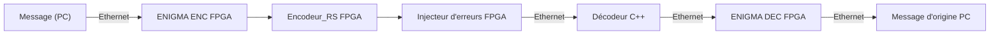

# CHIMERE
Chaîne Hybride d’Injection et de Mesure d’Erreurs pour Reed‑Solomon et Ethernet




*** TODO : *** 
-Enlever l'uart dans l'ENIGMA
-comprendre manipuler in/out de enigma et encoder_rs 
-créer un injecteur d'erreur simple dont l'entrée est générique ``` t : integer``` qui égale à une valeur fixe et fliper t bits de l'entrées (0 devient 1 et vice versa). 
-on reliée les 3 modules. 
