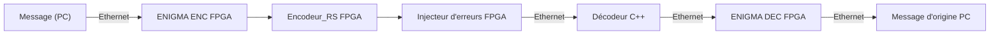

# CHIMERE
Chaîne Hybride d’Injection et de Mesure d’Erreurs pour Reed‑Solomon et Ethernet




# TODO :
```
Enlever l'uart dans l'ENIGMA. ```DONE``` 
comprendre manipuler in/out de enigma et encoder_rs.```DONE```
créer un injecteur d'erreur simple dont l'entrée est générique ``` t : integer``` qui égale à une valeur fixe et fliper t bits de l'entrées (0 devient 1 et vice versa). ```: We have alternative we could change the bits in the HW module in the top level or we can inject them in c++ ```
on reliée les 3 modules.```  DONE``` 
```
# Bloc Enigma
```
Pour utiliser le bloc Enigma, en entrée, il faut envoyer une donée sur 8 bits sur stream_in avec un flag
lorsque l'envoi de cette donée est fini ur enable. En sortie, on utilise le même fonctionnement, une
donnée sur 9 bits sur stream_out et un flag lorsque cette donnée est valide sur data_valid. La sortie est
sur 9 bits pour se connecter au bloc Encodeur RS mais le bit de poids fort est set à 0, il est donc très
facilement possible de réduire la sortie à 8 bits si nécéssaire.

Il faut configurer le bloc avant qu'il renvoie des lettres, pour cela, il faut indiquer pour chaque rotor son numéro et sa position iitiale, par exemple, si on veut regler le rotor numéro 2 en position 12 puis le rotor 1 en position 0 et enfin le rotor 3 en position 2, il faut rentrer la suite : "2 1 2 1 0 0 3 0 2". Ensuite, la machine  reverra les lettres codées selon la configuration rentrée plus tôt.
```

# Bloc Encodeur Reed‑Solomon RS(7,3)

```
Pour utiliser l’encodeur RS(7,3), vous devez lui fournir 3 symboles de 3 bits (soit 9 bits au total) sur le port data_in et activer le signal enable.
La sortie est un mot de code de 21 bits (data_out) contenant les 7 symboles (3 bits chacun). Un signal ready_flag indique que le calcul est terminé et que la sortie est valide.
```

---

# Project Structure

```
CHIMERE_DEVELOP/
│
├── doc/                # Documentation (subject,proposition , references)
├── SW/ 
      ── Qt/            # C++ Graphical Interface of Ethernet communication
      ── RS_ECC/        # C++ Library of the `RS(n,k)` encodec
├── HW/ 
      ── hw_srcs/       # VHDL implementation for FPGA of the CHIMERE HW part (ENIGMA + RS_ENCODER + (injector error optionnal))
                ── modules/
                            ── ETHERNET/    # VHDL & Verilog implementation for FPGA of ETHERNET Com
                            ── VHDL_ENIGMA/ # VHDL implementation for FPGA of the ENIGMA ENCRYPTION
                            ── VHDL_RS_ECC/ # VHDL implementation for FPGA of the RS_Encoder `RS(7,3)`                        
└── README.md           # Project documentation
```
